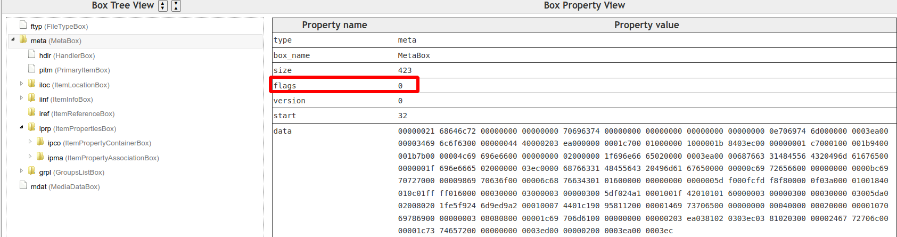

## HEIF Library

### 1. 代码分析

* HEIF Reader API and Library (under srcs/api/reader/)

  Reader为纯虚类，确定API接口，具体实现在srcs/reader/heifreaderimpl.hpp中，

* HEIF文件基于ISO/IEC 23008-12标准，采用ISOBMFF作为容器结构。

* `meta` box解析函数分析

  **HeifReaderImpl::handleMeta(StreamIO& io) **

  ```c++
  HeifReaderImpl::handleMeta()
  --->HeifReaderImpl::readBox()		// get bitstream
  --->MetaBox::parseBox()				// get metaBox
  --->HeifReaderImpl::extractMetaBoxProperties()	// return MetaBoxProperties
      --->HeifReaderImpl::extractMetaBoxItemPropertiesMap()	// return ItemFeaturesMap，从HEIF的metaBox中提取所有项item和元数据项的特征属性，构建ItemId-->特征标记 映射表
      	--->doReferencesFromItemIdExist()		// 检查是否存在类型为xxx的并从当前item出发的主动引用
      	--->ItemFeature::setFeature()
      	...
      	--->doReferencesToItemIdExist()			// 检查当前item是否被类型为xxx item的引用
      	--->ItemFeature::setFeature()
      --->HeifReaderImpl::extractMetaBoxEntityToGroupMaps()
      	--->MetaBox::getGroupsListBox()::getEntityToGroupsBoxes()	// 提取实体（Entity）到分组（Group）的映射关系，一张图片就是一个实体
      --->HeifReaderImpl::extractMetaBoxFeatures()	// 返回描述整个MetaBox特性的MetaBoxFeature对象
  --->HeifReaderImpl::extractItems()	// return MetaBoxInfo
     	--->loadItemData()				// 加载Item对应的数据到bitsteam结构体中
      --->type == "grid"				// 解析网格图参数
      	parseImageGrid()
      	getReferencedFromItemListByType()	// 获得dimg((Drived Image Reference)引用类型指向的基础图像的itemIds
      --->type == "iovl"				// 解析覆盖图参数
      	parseImageOverlay()
      	getReferencedFromItemListByType()
      --->processItemProperties()		// 解析文件中独立项目和逻辑分组各自的属性信息
      	--->iprp.getItemProperties(itemId)
      	--->iprp.getItemProperties(groupId)
      --->extractItemInfoMap()		// 遍历HEIF文件中的每个item，构建itemId -> ItemInfo映射表
  --->HeifReaderImpl::processDecoderConfigProperties() // 提取并关联HEIF文件中图像项目的解码配置参数，核心目标是为每个图像项目（如HEVC/AVC/JPEG编码）绑定对应的解码器参数集（如HVCC/AVCC/JPEG配置）
  --->HeifReaderImpl::getMasterImages()	// 查找master image数量
  ```
  
  meta相关数据结构
  
  ```c++
  struct MetaBoxProperties {
  	MetaBoxFeature {
  		MetaBoxFeatureSet == Set<MetaBoxFeatureEnum::Feature> // enum Feature{IsSingleImage,IsImageCollection,HasMasterImages...}
  	}
  	ItemFeaturesMap == Map<ImageId, ItemFeature>
          ItemFeature {
          	ItemFeatureSet == Set<ItemFeatureEnum::Feature>	// enum Feature{IsMasterImage,IsThumbnailImage,IsAuxiliaryImage...}
      	}
  	Groupings == Vector<EntityGrouping>
          EntityGrouping {
          	FourCC == char value[5]	// Grouping type，分组类型，通过FourCC编码
              GroupId					// Grouping ID，分组的唯一标识符
              Array<uint32_t>			// Grouped entity IDs，属于该分组的实体ID列表，如图像项或元数据项的ID，entityId具有唯一性
      	}
  }
  ```
  
  ```c++
  struct MetaBoxInfo {
  	unsigned int displayableMasterImages
      ItemInfoMap == Map<ImageId, ItemInfo>
          ItemInfo {
          	ForCCInt type			// 项目类型编码，图像类：hvc1、avc1、grid、jpeg，元数据类：exif、xml、mime(通过MIME类型封装)
              String name				// item可读名称，可选，图像item：MasterImage、Thumbnail_200x200，元数据item：Exif_Data_1
              String contentype		// 描述内容的MIME类型，当type=mime时有效，图像：image/jpeg，元数据：application/rdf+xml
              String contenEncoding	// 指示内容的压缩或编码方式，可选
              uint32_t width
              uint32_t height
              uint64_t displayTime	// 图像的显示时间戳，用于序列图像的播放时序控制，为0时标识第一帧立即显示
      	}
      Map<ImageId, Grid>						// 保存itemId与其对应的网格图
          Grid {
          	uint32_t outputWidth			// 网格整体输出的宽度
              uint32_t outputHeight			// 网格整体输出的高度
              uint32_t columns				// 网格行数，存储时减1，使用时加1
              uint32_t rows					// 网格列数，存储时减1，使用时加1
              Array<ImageId> imageIds			// 网格图引用的图像ID
      	}
      Map<ImageId, Overlay>					// 保存itemId与其对对应的覆盖图
          Overlay {
          	uint16_t r						// 画布填充色
              uint16_t g
              uint16_t b
              uint16_t a
              uint32_t outputWidth			// 画布宽度
              init32_t outputHeight			// 画布高度
              Array<offset> offset
                  offset {
                  	int32_t horizontal		// 子图像水平偏移
                      int32_t vertical		// 子图像垂直偏移
              	}
              Array<ImageId> imageIds			// 覆盖图对应的的图像ID
      	}
      Properties == Map<uint32_t, PropertyTypeVector>
          PropertyTypeVector == Vector<ItemPropertyInfo>
          	ItemPropertyInfo {
          		ItemPropertyType			// 属性类型标识，对应HEIF规范中定义的4字符码ispe/irot/pixi等
                  PropertyId == uint32_t		// 属性数据定位索引，HEIF中属性的原始数据集中存储在ItemPropertyContainer中，通过index可以检索
                  bool essential				// 属性必要性标记，若为true，解析器必需解析此属性，否则可能导致渲染错误
      		}
  }
  ```
  
  > 为什么MetaBoxInfo::ItemInfoMap::ItemInfo中，type=mime时，contentType必须指定具体类型？
  >
  > ：这是由HEIF标准的设计机制和数据类型兼容性需求决定的。mime类型的定位为通用容器，用于HEIF中封装非原生支持格式活扩展格式，允许HEIF文件携带任意类型的数据（如PNG、JPEG、文本等），而不限于HEVC/AVC等原生支持的编码格式。


### 2. Box类型及作用

HEIF文件结构层级：

```c++
File
├── ftyp (File Type Box)
├── meta (MetaBox, 元数据容器) ← 我们讨论的上下文    
│   ├── hdlr (HandlerBox)		 // 标识媒体类型
│   ├── iinf (ItemInfoBox)       // 存储项目信息
│   ├── iloc (ItemLocationBox)   // 存储项目数据位置
│   ├── iprp (ItemPropertiesBox) // 项目属性
│   └── idat (ItemDataBox)       // 实际项目数据
└── mdat (Media Data Box)        // 可能的外部媒体数据
```


#### 2.1 ftyp box

HEIF文件遵循ISOBMFF标准，其文件结构由多个box组成。其中`ftyp` box为文件开头的关键元数据，用于声明文件的兼容标准和版本。以一张常见的heif图片`ftyp`box为例：

| Property name     | Property value         |
| ----------------- | ---------------------- |
| type              | ftyp                   |
| box_name          | FileTypeBox            |
| size              | 32                     |
| start             | 0                      |
| major_brand       | mif1                   |
| minor_version     | 0                      |
| compatible_brands | heic, mif1, miaf, MiHB |

**关键术语：**

* major_brand：主品牌，标识文件的核心格式标准，`mif1`是HEIF标准中的MIAF（Multi-Image Application Format），是HEIF的一个子集规范，专门定义多图像容器的通用处理规则，对应ISO/IEC 23000-22标准。

* minor_version：次版本，表示文件核心格式标准的版本号，为0表示基础版本。此处说明该文件遵循`mif1`主品牌的初时版本规范，未其用后续扩展功能。

* compatible_brand：兼容品牌，声明文件兼容的其他标准，解析器会按顺序尝试匹配支持的品牌。

  | 品牌标识 | 技术含义                                         | 应用场景         |
  | -------- | ------------------------------------------------ | ---------------- |
  | heic     | HEIF基础图像容器品牌，标识使用HEVC编码的单帧图像 | 普通HEIC照片     |
  | mif1     | 与major_brand重复                                | 多图像容器       |
  | miaf     | MIAF通用兼容品牌，表示符合MIAF规范的最小功能集   | 通用多图像解析   |
  | MiHB     | Apple扩展品牌，表示支持HDR图像                   | apple proraw照片 |

**技术验证：**

可以使用`mp4dump`工具验证，读取 `ftyp`Box

```bash
mp4dump *.heic | grep -A 3 "ftyp"
```

#### 2.2 etyp box

`etyp` box：声明文件可能依赖或关联的外部数据源类型，主要用于标识文件的扩展兼容性或外部引用关系。

​	在HEIF标准中，主文件通常应包含完整数据，但在特定设计场景中，确实可能出现HEIF文件需要依赖外部数据的情况。例如：

**分片存储（Fragmented Storage）**

- **场景** ：
  大型HEIF文件（如动态图像序列）被拆分为多个物理文件（分片），主文件仅包含元数据，实际图像数据存储在外部文件中。
- 示例 ：
  - 主文件：`photo.heic`（包含`etyp`声明兼容分片类型 `hvc1`）
  - 分片文件：`photo_data1.hvc`、`photo_data2.hvc`（存储HEVC编码的图片数据）
- **作用** ：
  `etyp`向解析器表明：“我的图像数据分散在外部`.hvc`文件中，请按HEVC标准加载它们”。

以iphone的livehphoto设计为例，主文件为静态HEIC图片，包含`etyp`声明`avc1`，外部数据为动态视频部分，独立存储在`.mov`文件中，相册应用通过`etyp`发现需要加载外部视频，实现“live”动态效果。这样做的好处在于可以减少主文件体积，外部数据可独立更新，敏感数据可以存储在外部加密文件中，通过`etyp`声明解密方式。

#### 2.3 meta box

`meta`box：元数据容器，是核心信息枢纽，负责组织和管理图像的所有元数据与结构信息。在HEIF的 **`ItemInfoEntry`** 结构中（ISO/IEC 23008-12 第8.11.6节），定义了`flag`字段，`flags` 字段为32位无符号整数，用于描述图像项的属性。`flag`最低位（Bit 0） 的官方定义为：**`hidden_item`** （隐藏项）：若为 `1`，表示该项**不应被默认渲染或展示** ，除非明确请求。



**核心作用：**

* 存储图像项的元数据

  - **图像项定义** ：描述文件内所有图像项（`item`）的属性，如主图像、缩略图、Alpha通道、深度图等。

  - **关联关系** ：定义图像项之间的引用关系（如主图与缩略图的关联、多帧图像的序列关系）。

* 编码参数与属性
  - 存储图像的解码配置（如HEVC的`hvcC`配置）、旋转角度、色彩空间等参数。

* 扩展元数据，当某个item被其他项通过cdsc引用时，标记此项为`IsMetadataItem`。
  - 包含Exif、XMP等辅助数据，用于存储拍摄信息、版权声明等。
* 资源定位
  - 通过`iloc` Box记录每个图像项在文件中的物理位置和大小，实现快速数据访问。


##### 2.3.1 关键子box

`meta`box通过嵌套子box实现具体功能：

| 子Box类型                     | 作用描述                                                     |
| ----------------------------- | ------------------------------------------------------------ |
| **`hdlr(HandlerBox)`**        | 声明元数据用途（如 `pict` 表示图像元数据，`Exif` 表示Exif数据容器）。 |
| **`pitm(PrimaryItemBox)`**    | **主图像项标识** ：指定默认显示的图像项ID（如主图的`item_ID`）。 |
| **`iloc(ItemLocationBox)`**   | **数据位置索引** ：记录每个图像项在文件中的存储偏移量、长度及编码方式。 |
| **`iinf(ItemInfoBox)`**       | **图像项信息表** ：列出所有图像项的类型（如`hvc1`/`av01`）、属性及基础描述。 |
| **`iref(ItemReferenceBox)`**  | **项引用关系** ：定义图像项间的依赖（如缩略图引用主图、Alpha通道关联主图）。包含不同的引用类型，如cdsc，表示内容描述引用，auxl表示辅助图像引用。 |
| **`iprp(ItemPropertiesBox)`** | **属性容器** ：包含图像项的编码参数（如HEVC的`hvcC`）、旋转、色彩属性等。 |
| **`Exif`**                    | 嵌套存储Exif元数据（需通过`hdlr`声明类型为`Exif`）。         |
| **`grpl(GroupsListBox)`**     | 用于定义文件中的分组逻辑。                                   |

**结构示例：**

```
meta
├── hdlr (handler_type='pict')   // 声明为图像元数据
├── pitm (item_ID=1)             // 主图像项为ID=1
├── iinf
│   ├── infe (item_ID=1, type='hvc1')  // 主图为HEVC编码
│   └── infe (item_ID=2, type='Exif')  // Exif数据项
├── iloc
│   ├── item 1: offset=0x500, length=1200  // 主图数据位置
│   └── item 2: offset=0xA00, length=300   // Exif数据位置
└── iprp
    └── hvcC (HEVC配置参数)       // 主图的解码配置
```


##### 2.3.2 hdlr(HandlerBox)

作用：

* 指明媒体类型
  * 指明当前track（数据流）的用途类型，例如：主图像（`pict`，表示图片数据）、元数据（如Exif、XMP等）、缩略图（可能用`thmb`或其他自定义标识）
* 关联处理程序
  * 定义处理该数据的“处理器”（Handler），例如：视频编码器（如HEVC/H.265）、图像编码器（如AVIF或JPEG）、元数据解析器（如Exif工具）。

hdlr box的二进制结构如下（字段按顺序排列）：

| 字段名           | 大小（字节） | 描述                                                      |
| ---------------- | ------------ | --------------------------------------------------------- |
| **Version**      | 1            | 盒子版本（通常为0）                                       |
| **Flags**        | 3            | 标志位（通常全0）                                         |
| **Pre-defined**  | 4            | 保留字段（通常为0）                                       |
| **Handler Type** | 4            | 标识处理类型（如`pict`表示图片）                          |
| **Vendor**       | 4            | 厂商标识（如`appl`表示苹果，`mif1`表示HEIF标准）          |
| **Name**         | 可变长度     | 处理程序名称（如`HEVC Coding`或自定义字符串，以null结尾） |

在HEIF（HEIC）文件中，当同时存在**主图像（Primary Image）** 和**增益图（Gainmap Image）** 时，它们的`hdlr box`处理方式如下：

* **独立Track场景**

  如果主图像和增益图分别存储为**两个独立的Track** ，则每个Track都会包含自己的`hdlr box`，具体表现为：

  * **主图像的hdlr box**
    - `Handler Type`通常为`'pict'`，表示图像数据。
    - `Name`可能为`HEVC Coding`（假设使用HEVC编码）。
  * **增益图的hdlr box**
    * 若遵循标准扩展，可能定义新的`Handler Type`（如`'gain'`）。
    * 若厂商自定义（如苹果），可能沿用`'pict'`但通过`Name`字段区分（如`Apple Gainmap`）。

* **属性附加场景**

  如果增益图作为主图像的**属性（Item Property）** 存在（例如通过`ipco`或`auxC` box关联），则无需单独Track。此时**仅主图像的hdlr box存在** ，增益图通过其他元数据描述。


##### 2.3.3 iloc(ItemLocationBox)

用于**描述文件中各个数据项（Item）的存储位置和访问方式** 。

作用：

* **定位数据项**

  记录每个Item（如图像、缩略图、元数据等）在文件中的**物理存储位置** （字节偏移量）和**长度** ，便于直接访问。

* **支持分块存储**

  允许单个Item的数据分散在多个**extent（数据段）** 中，例如分片存储的HEVC图像或分块的元数据。

iloc box的二进制结构如下（字段按顺序排列）：

| 字段名               | 大小（字节） | 描述                                                         |
| -------------------- | ------------ | ------------------------------------------------------------ |
| **Version**          | 1            | 版本号（0或1，版本1支持64位偏移量）                          |
| **Offset Size**      | 4 bits       | 偏移量字段的字节长度（4/8表示4或8字节，版本1支持8字节）      |
| **Length Size**      | 4 bits       | 长度字段的字节长度（同上）                                   |
| **Base Offset Size** | 4 bits       | 基础偏移量字段的字节长度（仅版本1存在）                      |
| **Reserved**         | 4 bits       | 保留字段（通常为0）                                          |
| **Item Count**       | 2或4         | 数据项的总数（版本0为2字节，版本1为4字节）                   |
| **Item Entries**     | 可变长度     | 每个Item的条目，包含ID、数据引用索引、基础偏移量和extent列表（见下表） |

每个Item Entry包含以下字段：

| 字段名                   | 大小（字节）         | 描述                                                         |
| ------------------------ | -------------------- | ------------------------------------------------------------ |
| **Item ID**              | 2或4                 | Item的唯一标识符（版本0为2字节，版本1为4字节）               |
| **Data Reference Index** | 2                    | 数据引用索引（通常为0，表示数据在当前文件）                  |
| **Base Offset**          | 根据Base Offset Size | 基础偏移量（用于计算实际偏移，若为0则直接使用extent的偏移）  |
| **Extent Count**         | 2                    | 该Item的数据段（extent）数量                                 |
| **Extent Entries**       | 可变长度             | 每个extent的偏移量和长度（根据Offset Size和Length Size定义字节数） |


##### 2.3.4 iinf(ItemInfoBox)

​	`ItemInfoBox`用于**描述文件中所有数据项（Item）的元数据信息**。

作用：

* **全局Item目录**

  记录文件中所有**数据项（Item）** 的基本信息，包括图像、缩略图、增益图、元数据等，每个Item对应一个`item_info_entry`。

* **定义Item类型与属性**

  每个`item_info_entry`包含Item的**类型编码（如`hvc1`、`grid`等）** 、**内容类型（MIME类型）** 、**保护方案（如加密）** 等关键元数据。

* **关联其他元数据**

  通过`item_ID`与`iloc`（定位数据位置）、`ipma`（属性关联）等Box联动，构建完整的文件解析逻辑。

`iinf` box的结构：

```
iinf Box (Item Information Box)
├── version (1字节, 版本号)
├── entry_count (2或4字节, Item条目数)
└── item_info_entry列表 (每个条目包含以下字段)
    ├── item_ID (2或4字节, Item唯一标识)
    ├── item_protection_index (2字节, 保护方案索引)
    ├── item_type (4字节, 类型编码，如'hvc1'、'avc1'、'Exif'等)
    ├── item_name (可变长度, 可选的Item名称)
    └── content_type / content_encoding (可选, 如MIME类型)
```

关键字段详解

1. **item_type**
   - 标识Item的数据格式，常见类型包括：
     - `hvc1`：HEVC编码的主图像。
     - `grid`：分块图像（如全景图）。
     - `Exif`：Exif元数据。
     - `mime`：自定义MIME类型（需结合`content_type`字段）。
     - `gain`：增益图（厂商可能扩展自定义类型）。
2. **item_protection_index**
   - 若Item被加密或受DRM保护，此字段指向`sinf`（Protection Scheme Info Box）中的方案索引。
3. **content_type**
   - 当`item_type='mime'`时，此字段定义具体的MIME类型（如`image/jpeg`、`image/png`）。


##### 2.3.5 pitm(PrimaryItemBox)

用于**指定文件中的主数据项（Primary Item）** ，即默认显示的图像或核心内容。

作用：

* **定义主Item**

  明确文件中哪一个Item（如图像、视频序列）是**默认加载和显示的主体内容** ，通常对应最高分辨率或完整视图的图像。

* **简化解析流程**

  解析器无需遍历所有Item，直接通过`pitm`快速定位主资源，提升文件打开效率。

* **兼容多内容场景**

  当文件包含多个图像（如连拍、实况照片、多分辨率版本）时，`pitm`确保软件能正确选择默认展示项。

结构：

| 字段名      | 大小（字节） | 描述                                             |
| ----------- | ------------ | ------------------------------------------------ |
| **Version** | 1            | 版本号（0或1，版本1支持4字节Item ID）            |
| **Item ID** | 2或4         | 主Item的唯一标识符（版本0为2字节，版本1为4字节） |

与其它Box的关联：

* `iinf` Box

  通过`pitm`中的Item ID，在`iinf`中查找对应的Item类型（如`hvc1`表示HEVC编码的主图像）。

* `iloc` Box

  结合`iloc`定位主Item的存储位置（偏移量、长度），实现数据加载。

* `ipma/ipco` Box

  主Item的属性（如旋转角度、色彩空间）通过`ipma`关联到`ipco`中的属性配置。


##### 2.3.6 iprp(ItemPropertiesBox)

管理所有Item属性（如旋转、色彩空间、增益图参数等）的核心容器*

作用：

* **集中管理属性定义与关联**

  `iprp` 包含两个关键子Box：

  * **`ipco`（ItemPropertyContainerBox）** ：存储所有**属性定义** （如旋转角度、色彩配置）。
  * **`ipma`（ItemPropertyAssociationBox）** ：将属性关联到具体的**Item** （通过`item_ID`）。

* **避免冗余存储**

  * 属性（如统一应用的色彩配置）只需在`ipco`中定义一次，多个Item可通过`ipma`引用同一属性，减少文件体积。

* **支持复杂元数据扩展**

  * 允许动态添加自定义属性（如厂商特定的增益图参数、深度信息等）。

结构：

```c++
iprp Box (Item Properties Box)
├── ipco Box (Item Property Container)
│   ├── Property 1 (如旋转属性 'rrot')
│   ├── Property 2 (如色彩配置 'colr')
│   └── ... 其他属性定义
└── ipma Box (Item Property Association)
    ├── Entry 1: item_ID=1 → [Property Index 1, Property Index 2...]
    └── Entry 2: item_ID=2 → [Property Index 3...]
```

子box详解：

###### 2.3.6.1 `ipco` Box（属性定义库）

存储所有属性类型，每个属性通过为一索引标识。

| 属性类型                       | 作用示例                        |
| ------------------------------ | ------------------------------- |
| `rrot` (Rotation)              | 定义图像旋转角度（90°, 180°等） |
| `colr` (Color)                 | 指定色彩空间（sRGB、Rec.2020）  |
| `imir` (Mirror)                | 镜像翻转（水平/垂直）           |
| `clap` (Clean Aperture)        | 裁剪区域定义                    |
| `ispe` (Image Spatial Extents) | 图像分辨率（宽高）              |
| 自定义属性                     | 厂商扩展（如Apple的增益图参数） |

* colr box结构体

```c++
struct ColourInformation {
    FourCC colourType;                   // [核心] 颜色信息类型标识，决定后续字段的解析方式，常见值：nclx/rICC/prof，nclx表示使用标准化的视频颜色参数
    uint16_t colourPrimaries;            // [nclx] 色域标准，nclx专用参数，定义三原色色度坐标，1=BT.709，9=BT.2020，
    uint16_t transferCharacteristics;    // [nclx] 光电转换特性，定义光电转换函数，1=BT.709，16=PQ(HDR)，18=HLG，
    uint16_t matrixCoefficients;         // [nclx] RGB/YUV转换矩阵，1=BT.709，9=BT.2020
    bool fullRangeFlag;                  // [nclx] 亮度范围标识，true=0-255（全范围），false=16-235（有限范围）
    Array<uint8_t> iccProfile;           // [ICC] 颜色配置文件数据
};
```

google给的样张中gainmap部分nclx三个参数都为2，具体意义如下：	

​	colourPrimaries = 2：表示**Unspecified Video** （未指定的视频色域），表示色域信息未明确指定，解码器应使用**默认或上下文相关的色域** （通常回退到 BT.709/sRGB）。

​	transferCharacteristics = 2：表示**Unspecified Video** （未指定的光电转换特性），未定义光电转换函数（OETF/EOTF），解码器需**自行推断或使用默认曲线** （通常假设为 BT.709 的伽马曲线）。

​	matrixCoefficients = 2：表示**Unspecified** （未指定的矩阵系数），YUV↔RGB转换矩阵未定义，解码器应**优先采用 BT.601 或 BT.709 矩阵** （取决于分辨率）。


###### 2.3.6.2 `ipma` Box（属性关联库）

​	**映射Item与属性** ：每个条目通过`item_ID`关联一个Item，并列出其所有属性索引（指向`ipco`中的属性）。

与其它Box的关联：

1. **从`iinf`获取Item类型**
   通过`iinf`确定Item的用途（如主图像、缩略图）。
2. **通过`ipma`查找属性索引**
   根据Item的`item_ID`，在`ipma`中找到关联的属性索引列表。
3. **从`ipco`提取属性值**
   按索引从`ipco`中读取具体属性值（如旋转角度=90°）。
4. **应用属性到数据**
   结合`iloc`定位的像素数据，按属性处理图像（如旋转后显示）。


##### 2.3.7 idat(ItemDataBox)

用于**内联存储一个或多个Item的原始数据** 的容器。

作用：

* **集中存储小尺寸数据**

  将多个Item的数据（如图像像素、Exif元数据、缩略图）直接嵌入到`idat` Box中，无需外部文件或分散存储。

* **优化访问效率**

  避免频繁的文件寻址，对小型数据（如短文本元数据、图标）的读取更高效。

* **简化文件结构**

  减少`iloc` Box的外部数据引用依赖，适用于数据量小且无需独立存储的场景。

结构：

| 字段/结构      | 描述                                                         |
| -------------- | ------------------------------------------------------------ |
| **Box Header** | 标准Box头（类型`idat`，包含长度和版本信息）                  |
| **数据块序列** | 连续存储的二进制数据流，可能包含多个Item的数据（无显式分隔符） |
| **引用方式**   | 通过`iloc` Box的`offset`字段指向`idat`内的起始位置，结合`length`提取 |

与`iloc`Box的协作：

1. **数据定位流程**

   - `iloc` Box中某个Item的`offset`字段指向`idat`内的偏移量。
   - `length`字段指定从该偏移量读取的数据长度。

2. **示例**
   假设`idat`存储了三个Item的数据：

   复制代码

   ```
   idat Box:
     [Item1数据][Item2数据][Item3数据]
   ```

   - `iloc`中Item1的`offset=0`, `length=100`
   - Item2的`offset=100`, `length=150`
   - Item3的`offset=250`, `length=80`

适用场景：

| **场景**           | **使用`idat`的优势**                           |
| ------------------ | ---------------------------------------------- |
| **小型元数据存储** | Exif/XMP数据（几百字节）直接内联，减少文件碎片 |
| **低分辨率缩略图** | 快速访问预览图，无需解码主图像                 |
| **文本注释**       | 短文本（如拍摄者信息）内联存储，提升读取速度   |
| **图标/标识**      | 小尺寸Logo或水印直接嵌入，简化文件结构         |


##### 2.3.8 iref(ItemReferenceBox)

用于**定义不同Item之间的引用关系**，实现数据关联与结构化组合。

作用：

* **建立逻辑关联**

  通过引用关系将多个Item（如图像、元数据、缩略图）**绑定为逻辑整体** 。例如：

  - 缩略图 → 主图像
  - Exif元数据 → 对应图像
  - 分片图像（Tiles） → 组合为完整图像

* **支持复合内容**

  实现复杂场景的关联，如：

  - **实况照片** ：多帧图像 + 音频 + 深度图
  - **分块存储** ：多个分片（Tile）拼合为大图
  - **衍生内容** ：**HDR图像的主图与增益图**

* **明确依赖关系**

  解析器可根据引用链按需加载相关Item，避免冗余解析。

结构：

`iref` Box由多个**引用条目** 构成，每个条目包含以下字段

| 字段名                | 大小（字节） | 描述                                                         |
| --------------------- | ------------ | ------------------------------------------------------------ |
| **引用类型（Type）**  | 4            | 4字符的引用类型标识（如`thmb`表示缩略图，`cdsc`表示内容描述引用） |
| **引用数量（Count）** | 2或4         | 被引用的Item数量（版本0为2字节，版本1为4字节）               |
| **From Item ID**      | 2或4         | **发起引用的Item ID** （如缩略图的ID）                       |
| **To Item IDs**       | 2或4 × N     | **被引用的Item ID列表** （如主图像的ID）                     |

常见引用类型：

| 类型（4字符） | 用途示例                                       |
| ------------- | ---------------------------------------------- |
| **`thmb`**    | 缩略图引用主图像（From=缩略图ID，To=主图像ID） |
| **`cdsc`**    | 内容描述引用（如Exif元数据引用对应的图像ID）   |
| **`auxl`**    | 辅助图像引用（如深度图、透明度图引用主图像）   |
| **`dimg`**    | 分片图像引用（多个分片Item引用到完整图像ID）   |
| **`base`**    | 基础图像引用（如HDR图像的主图被增益图层引用）  |

实际应用示例：

场景1：缩略图关联主图像

- **Item 1** ：主图像（ID=1，类型`hvc1`）
- **Item 2** ：缩略图（ID=2，类型`hvc1`）

`iref`条目 ：

```
Type='thmb', From=2, To=[1]
```

表示缩略图（ID=2）引用了主图像（ID=1）。

场景2：Exif元数据关联图像

- **Item 3** ：Exif元数据（ID=3，类型`Exif`）
- **Item 1** ：主图像（ID=1）

`iref`条目：

```
Type='cdsc', From=3, To=[1]
```

表示Exif元数据（ID=3）描述的是主图像（ID=1）。

场景3：分片图像拼合

- **Item 4** ：完整图像（ID=4，类型为`grid`）
- **Item 5-8** ：分片图像（ID=5,6,7,8，类型为`hvc1/avc1`）

`iref`条目 ：

```
Type='dimg', From=4, To=[5,6,7,8]
```

表示完整图像（ID=4）由分片5-8组合而成。可以通过查找`ipco` Box中Item 4对应的的Property，确定**行列数以及分片尺寸等**

与其它Box的协作：

1. **`iinf` Box**
   通过`iinf`确定引用双方Item的类型（如确认From=2是缩略图，To=1是主图像）。
2. **`iloc` Box**
   结合`iloc`定位被引用Item的数据位置，实现关联数据的同步加载。
3. **`meta` Box**
   `iref`通常嵌套在`meta` Box中，作为文件元数据的一部分。


##### 2.3.9  grpl(GroupsListBox)

根据HEIF（ISO/IEC 23008-12）标准，`GroupsListBox`（FourCC为`grpl`）是`MetaBox`的子Box之一，**将多个Item（如图像、音频、文本）组织成逻辑组** ，以实现内容的分层管理或关联表达。

**`GroupsListBox`的作用** ：

* **管理分组关系** ：它存储了多个`EntityToGroupBox`条目，每个条目描述一个“组”（Group）及其关联的实体（Entities）。

* 分组类型：

  * **`altr`**，Alternate Group，表示同一内容的不同版本，如不同分辨率或编码格式的图片。

  * **`eqiv`**，Equivalence Group，表示逻辑上等效的项，如不同语言的字幕。

  * **`ster`**，Stereo Group，专用于立体图像Stereo Image的关联管理，ster分组的核心目的是将多个实体Entities组织成一个立体图像。一个典型的`ster`分组在HEIF文件中的逻辑结构如下

    ```shell
    GroupsListBox（grpl）
    └── EntityToGroupBox（Stereo类型）
        ├── group_id: 100          // 分组唯一标识
        ├── type: 'ster'           // 分组类型为立体
        └── entity_ids: [1, 2]     // 实体ID列表（左眼=1，右眼=2）
    ```

**Entity与Group的关系：**

- 每个实体（如一张图片）可以通过`entityId`唯一标识。
- 分组允许将多个实体组织为逻辑单元（例如：主图+缩略图+深度图）。

假设HEIF文件中包含一张图片的三种分辨率版本（高、中、低），它们的`entityId`分别为1、2、3。通过`GroupsListBox`可以定义一个`altr`类型的分组：

```shell
GroupId: 100
Type: 'altr'
EntityIds: [1, 2, 3]
```

#### 2.4 moov box

全称电影盒movie box，继承自ISO基础媒体文件格式（BMFF）的关键Box类型，`moov`作为元数据容器，存储全局媒体描述信息，包括图像项的元数据（如`ItemInfoBox`、`ItemLocationBox`）。解码配置参数如HVCC/AVCC/JPEG配置），时间轴信息如动画帧的时序、持续时间），轨道Track定义，主要用于扩展场景，如动态图形序列或混合媒体。在HEIF中，`moov`box为非必需，它的存在标志着文件包含**时间线媒体或动态内容** 。

**静态HEIC文件的典型结构**

```c++
┌───────┐
│ ftyp  │ → 文件类型声明（如"heic"）
├───────┤
│ meta  │ → 包含所有静态图像项元数据（ItemInfoBox/ItemLocationBox等）
├───────┤
│ mdat  │ → 存储实际编码数据（如HEVC主图、缩略图二进制）
└───────┘
```

**动态HEIF文件结构**

```c++
┌───────┐
│ ftyp  │
├───────┤
│ meta  │ → 静态图像项（如主图）
├───────┤
│ moov  │ → 视频轨道定义（动态部分）
├───────┤
│ mdat  │ → 存储静态图像和动态视频数据
└───────┘
```

**动态图像序列（Animation）**

- **场景** ：HEIF文件包含多帧图像组成的动画（如Apple Live Photo的动态部分）。
- 实现 ：
  - `moov` Box定义动画的帧率、播放顺序和时间戳。
  - 图像数据通过`meta` Box或外部引用关联到`moov`中的轨道。

**混合媒体容器**

- **场景** ：HEIF文件同时包含静态图像和视频/音频轨道。
- 示例 ：
  - 主图通过`meta` Box管理（静态HEIC图像）。
  - 附加视频通过`moov` Box的`trak`（轨道）描述。

**关键子box：**

| 子Box类型                      | 作用描述                                                     |
| ------------------------------ | ------------------------------------------------------------ |
| **`mvhd` (Movie Header Box)**  | 定义全局时间参数（如时间刻度、时长）。                       |
| **`trak` (Track Box)**         | 描述单个媒体轨道（如视频轨、音频轨），包含编解码参数、时间戳映射。 |
| **`mvex` (Movie Extends Box)** | 用于分片媒体（类似MP4的Fragmented MP4）。                    |

#### 2.5 moof box

全称Movie Fragment Box，继承自ISO基础媒体文件格式（BMFF）的关键Box类型，作用于分片存储（将媒体数据分割为多个片段（Fragment），每个`moof`对应一个分片），动态流式传输。
